# Binance Futures Testnet Trading Bot

A clean, production-structured Python CLI application for placing orders on the **Binance USDT-M Futures Testnet**. Built with direct REST calls — no third-party Binance SDK required.

---

## Features

- **MARKET orders** — fill immediately at the best available price
- **LIMIT orders** — rest in the order book at a specified price
- **BUY / SELL** support for all order types
- **STOP_MARKET orders** — trigger a market order when price hits a stop level
- **STOP_LIMIT orders** *(bonus)* — trigger a limit order at a stop level, giving you price control
- **TWAP execution** *(bonus)* — split large orders into equal time-spaced slices to reduce market impact
- **Interactive menu mode** — guided step-by-step prompts with input re-validation
- **Flag mode (CLI)** — pass all parameters directly for scripting and automation
- **Rotating log files** — full audit trail of every request and response
- **Input validation** — catches bad input before any API call is made
- **Secure credential handling** — API keys loaded from `.env`, never hardcoded

---

## Project Structure

```
Trading_Bot/
├── bot/
│   ├── __init__.py          # Package exports
│   ├── client.py            # Low-level REST client (HMAC auth, signing, HTTP)
│   ├── orders.py            # Order placement logic (MARKET, LIMIT, STOP_MARKET, STOP_LIMIT, TWAP)
│   ├── validators.py        # Input validation — called before any API request
│   └── logging_config.py   # Rotating file + console log setup
├── cli.py                   # CLI entry point (flag mode + interactive menu)
├── logs/
│   ├── trading_bot.log          # Auto-created on first run
│   ├── sample_market_order.log  # Sample output: MARKET order
│   └── sample_limit_order.log   # Sample output: LIMIT order
├── .env.example             # Template for API credentials
├── .gitignore
├── requirements.txt
└── README.md
```

---

## Setup Instructions

### 1. Clone the repository

```bash
git clone https://github.com/your-username/Trading_Bot.git
cd Trading_Bot
```

### 2. Install dependencies

```bash
pip install -r requirements.txt
```

### 3. Configure API credentials

```bash
cp .env.example .env
```

Open `.env` and paste your Testnet API key and secret (see next section).

---

## Binance Testnet Setup

This bot targets the **Binance Futures Testnet** — a risk-free paper trading environment. You need a free API key to use it.

**Steps to generate API keys:**

1. Visit **https://testnet.binancefuture.com**
2. Click **Login with GitHub** (no Binance account needed)
3. Click your username (top right) → **API Management**
4. Click **Generate** to create a new key pair
5. Copy **both** the API Key and Secret — the secret is shown **only once**

**Where to place the keys:**

Paste them into your `.env` file:

```
BINANCE_TESTNET_API_KEY=your_api_key_here
BINANCE_TESTNET_API_SECRET=your_api_secret_here
```

> The `.env` file is listed in `.gitignore` and will never be committed to version control.

---

## Environment Variables

| Variable | Description |
|---|---|
| `BINANCE_TESTNET_API_KEY` | Your Binance Futures Testnet API key |
| `BINANCE_TESTNET_API_SECRET` | Your Binance Futures Testnet API secret |

These can also be set directly in your shell instead of using a `.env` file:

```bash
# Linux / macOS
export BINANCE_TESTNET_API_KEY="your_key"
export BINANCE_TESTNET_API_SECRET="your_secret"

# Windows CMD
set BINANCE_TESTNET_API_KEY=your_key

# PowerShell
$env:BINANCE_TESTNET_API_KEY="your_key"
```

---

## Running Examples

### Check balance

```bash
python cli.py --balance
```
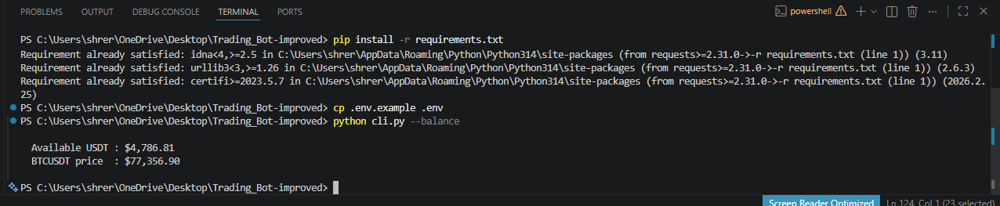

### MARKET BUY

```bash
python cli.py --symbol BTCUSDT --side BUY --type MARKET --quantity 0.001
```
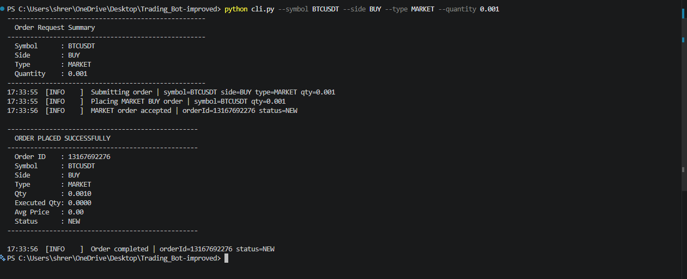

### MARKET SELL

```bash
python cli.py --symbol BTCUSDT --side SELL --type MARKET --quantity 0.001
```
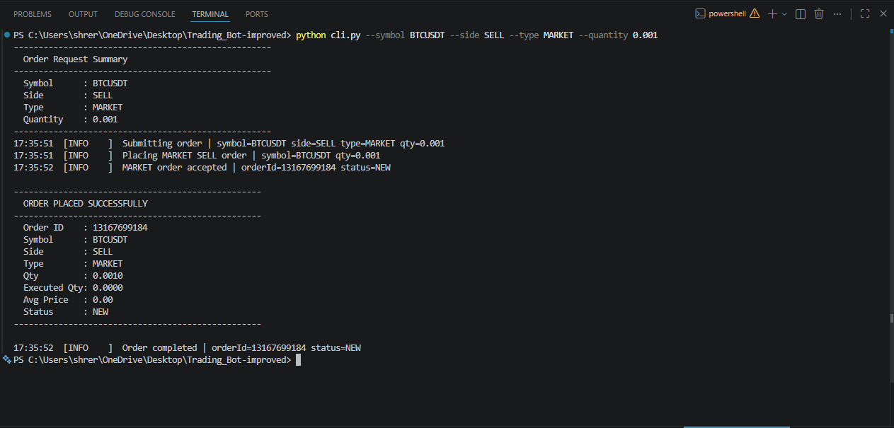

### LIMIT BUY

```bash
python cli.py --symbol BTCUSDT --side BUY --type LIMIT --quantity 0.001 --price 75000
```
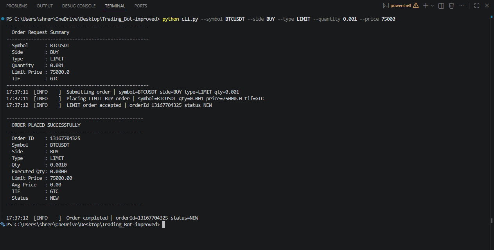

### LIMIT SELL

```bash
python cli.py --symbol BTCUSDT --side SELL --type LIMIT --quantity 0.001 --price 85000
```
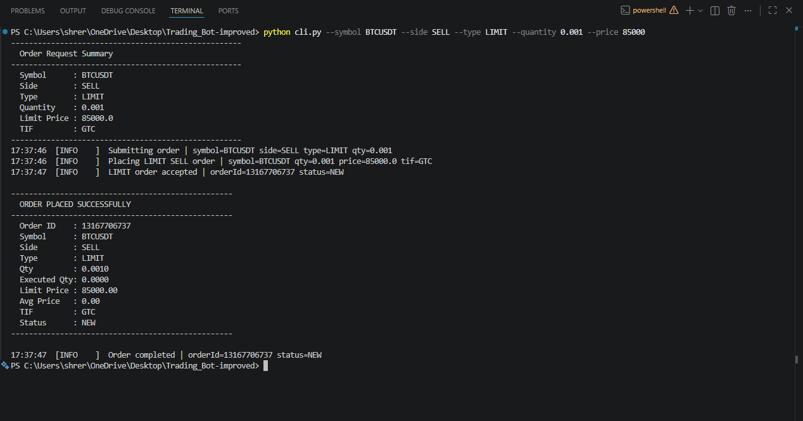

### STOP_LIMIT SELL *(bonus)*

```bash
python cli.py --symbol BTCUSDT --side SELL --type STOP_LIMIT --quantity 0.001 --price 75000 --limit-price 74900
```
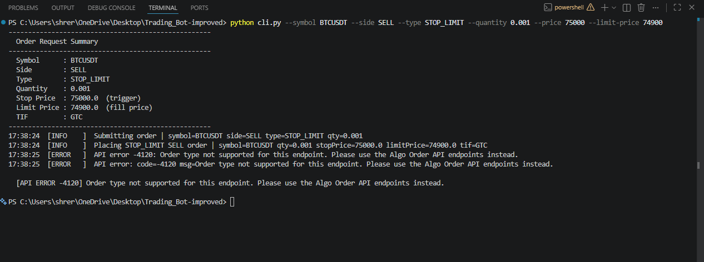

### TWAP BUY *(bonus)*

```bash
python cli.py --symbol BTCUSDT --side BUY --type TWAP --quantity 0.005 --slices 5 --interval 10
```
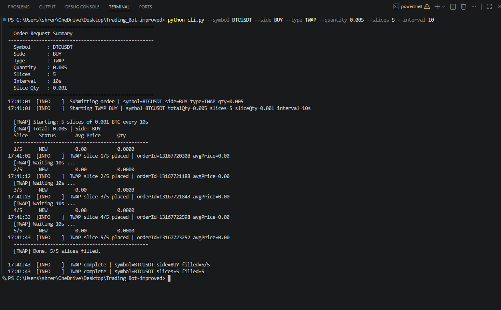

### Interactive menu mode

```bash
python cli.py --menu
# or just:
python cli.py
```
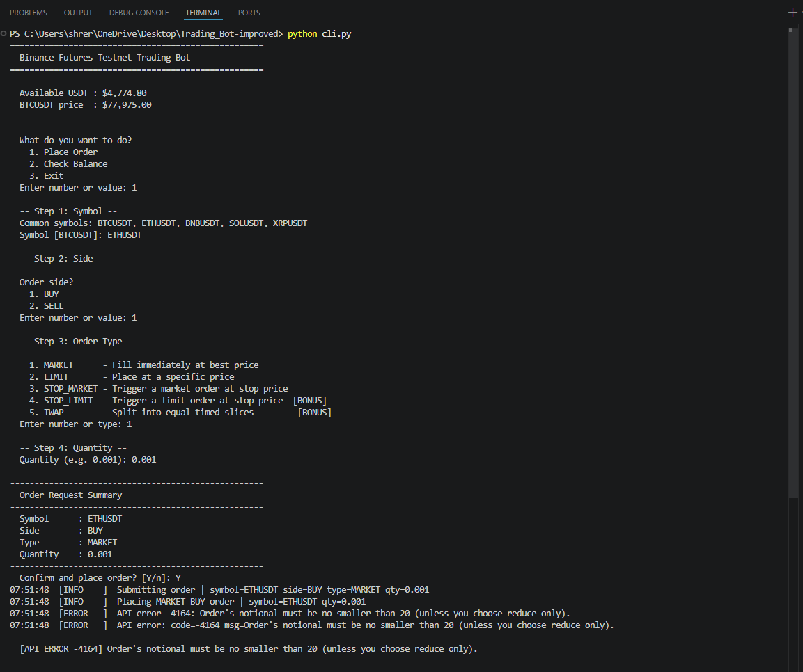

---

## Sample Output

### MARKET BUY

```
----------------------------------------------------
  ORDER PLACED SUCCESSFULLY
----------------------------------------------------
  Order ID    : 13061475740
  Symbol      : BTCUSDT
  Side        : BUY
  Type        : MARKET
  Qty         : 0.0100
  Executed Qty: 0.0100
  Avg Price   : 78395.10
  Status      : FILLED
----------------------------------------------------
```

### LIMIT SELL

```
----------------------------------------------------
  ORDER PLACED SUCCESSFULLY
----------------------------------------------------
  Order ID    : 13061498822
  Symbol      : BTCUSDT
  Side        : SELL
  Type        : LIMIT
  Qty         : 0.0050
  Executed Qty: 0.0000
  Limit Price : 79000.0
  Avg Price   : 0.00
  TIF         : GTC
  Status      : NEW
----------------------------------------------------
```

### TWAP progress table

```
  [TWAP] Starting: 5 slices of 0.001 BTC every 10s
  [TWAP] Total: 0.005 | Side: BUY
  Slice    Status       Avg Price      Qty
  ------------------------------------------------
  1/5      FILLED       78402.30       0.001
  [TWAP] Waiting 10s ...
  2/5      FILLED       78415.80       0.001
  ...
  5/5      FILLED       78388.50       0.001
  ------------------------------------------------
  [TWAP] Done. 5/5 slices filled.
```

---

## Logging

Log files are written to `logs/trading_bot.log` and rotate automatically at 5 MB (3 backups kept).

**Two output levels:**

| Handler | Level | Purpose |
|---|---|---|
| Console | INFO | Human-readable status messages |
| File | DEBUG | Full request/response trace for auditing |

**What is logged:**
- Every API request (method, URL, parameters)
- Every API response (HTTP status, body snippet)
- Validation failures
- Order placement events (orderId, status)
- All exceptions with full tracebacks

Sample log entries are provided in `logs/sample_market_order.log` and `logs/sample_limit_order.log`.

---

## Error Handling

**Input validation** (before any API call):
- Symbol must be alphanumeric and end with USDT/USDC/BTC
- Quantity must be a positive number
- LIMIT orders require `--price`
- STOP_LIMIT orders require both `--price` (trigger) and `--limit-price` (fill)
- TWAP slices: 2–20; interval: 5–300 seconds

**API errors** — common codes mapped to actionable hints:

| Code | Meaning | Hint shown |
|---|---|---|
| -2015 | Invalid API key | Check key/secret and IP restrictions |
| -1121 | Invalid symbol | Use a valid pair like BTCUSDT |
| -4003 | Quantity too small | BTCUSDT minimum is 0.001 |
| -2021 | Stop price direction wrong | Below market for SELL, above for BUY |
| -4016 | Price out of range | Check current market price |

**Network errors** — connection failures and timeouts are caught and displayed with clear messages. The application never crashes on network issues.

---

## Assumptions

- **USDT-M Futures only** — the bot targets the `/fapi/` endpoints (USDT-margined perpetuals)
- **Testnet only** — base URL is `https://testnet.binancefuture.com`. For Binance Demo Trading, change `BASE_URL` in `bot/client.py` to `https://demo-fapi.binance.com`
- **Internet access required** — all operations are live REST calls to the Binance testnet
- **Python 3.9+** — uses `dict | None` union type hints

---

## Bonus Features

| Feature | Description |
|---|---|
| **STOP_LIMIT orders** | Two-price stop orders: a trigger price activates a limit order at the fill price. Protects against excessive slippage vs plain STOP_MARKET |
| **TWAP execution** | Splits a large order into N equal market orders placed every X seconds. Reduces market impact and achieves a time-averaged fill price |
| **Interactive menu** | Full guided menu with per-field validation, re-prompts on bad input, and an order confirmation step before submission |
| **Live symbol validation** | `validate_symbol_live()` optionally queries exchange info to confirm the symbol exists before placing an order |

---

## Screenshots

### Market Order

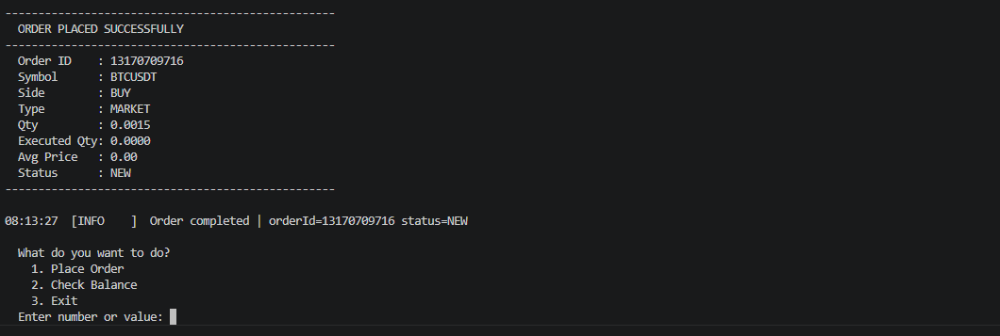

### Limit Order

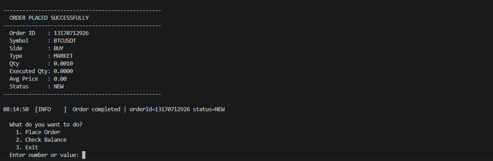

### Log File

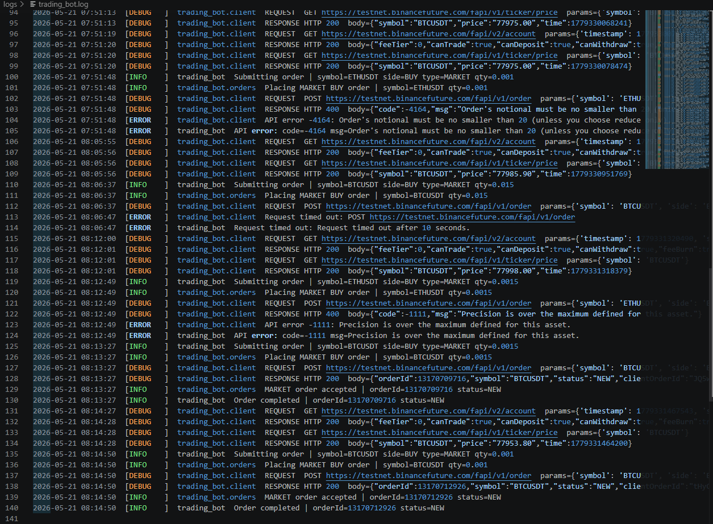

---

## Dependencies

| Package | Purpose |
|---|---|
| `requests` | HTTP client for Binance REST API calls |
| `python-dotenv` | Load API credentials from `.env` file |

All other functionality uses Python's standard library.
